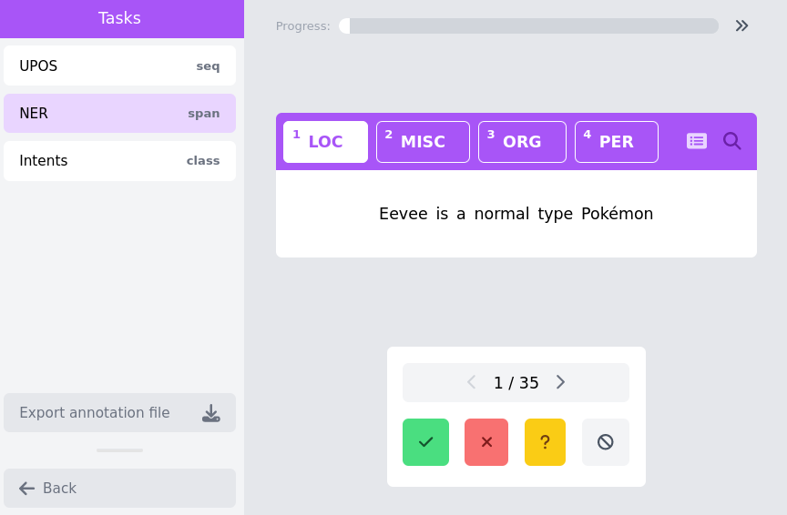
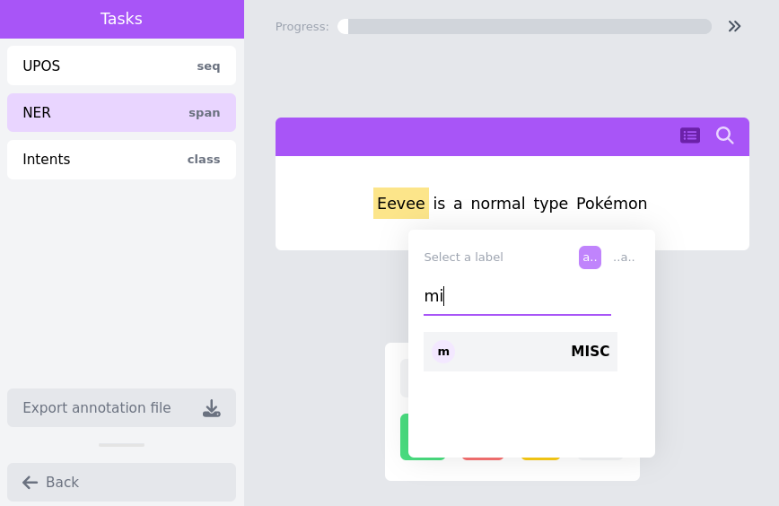
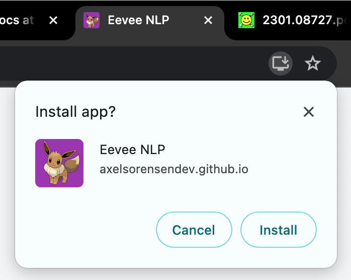

# Eevee: An Easy Annotation Tool

## Installation
There is no need to install, just go to https://axelsorensendev.github.io/Eevee/ and get started!

## Usage
### Setup page


### Annotation interface
In the annotation interface, we can see an overview of the tasks on the left,
and the current utterance with its annotation in the middle of the screen. We
also have status buttons on the bottom, and a progress bar on the top. We
provide two annotations modes, which can be toggled through the button on the
top-right of  the utterance. These are the "keyboard mode" and the "search
mode". The keyboard mode is the default for tasks with less than 10 labels, and
allows for selection of the right label through the number keys on the
keyboard. The search mode instead uses a pop-up box, in which the annotator can
search for- and select a label. Both interfaces are shown in the screenshots
below:




## Offline use
Once the Eevee link has been visited once, the tool will be cached in the browser and can be used offline.
The tool can also be downloaded from the browser as a Progressive Web Application, allowing it to be used as a native desktop app. 



### Shortcuts
The main keyboard shortcuts are available in the annotation interface
* Arrows up/down: navigate between tasks (also used for navigating through labels in 'search mode')
* Arrows left/right: navigate through data
* Number keys: when less than 10 labels, they can be used to select labels
* Spacebar: mark an annotation instance as 'done'
* Enter: select the highlighted label in the 'search mode' popup
* Esc: close the 'search mode' popup

## Use-cases
- [Annotate slot and intent detection for a new language](docs/xsid.md)
- 

## Compatability with other services
### Datasets library
To use data from the Huggingface datasets library with Eevee, we provide the `hf2conll.py` script. To use it, the steps are as follows:

* Find the dataset you would like to add annotation to: https://huggingface.co/datasets
* Download the data with: `python3 scripts/hf2conll.py conll2003`
* Import the data into Eevee, and use the setup-page as explained in [Usage](#usage)

### MaChAmp
The data exported from Eevee can directly be used in the [MaChAmp toolkit](https://github.com/machamp-nlp/), to easily train
and evaluate state-of-the-art models. However, MaChAmp is based on dataset configuration files. These can automatically be 
generated from the output of Eevee. This can be done with the `eevee2machamp` script provided in the `scripts` folder. The 
script expects an Eevee dataset file and the path to the training data (+optionally development data path), as follows:

```
python3 scripts/eevee2machamp.py pokemon.json and pokemon.conll
```

The script will produce a MaChAmp dataset configuration file and the training command.

