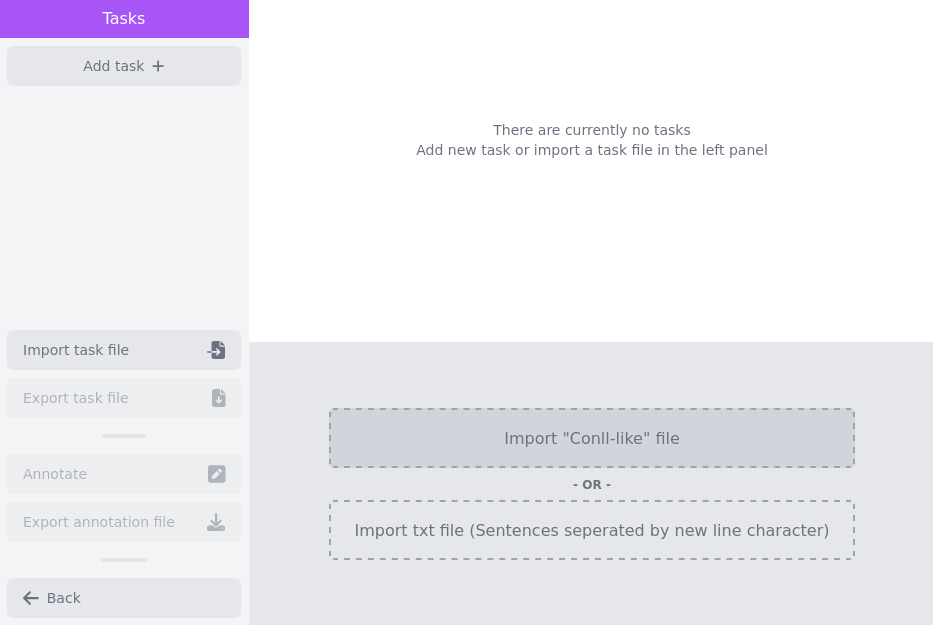
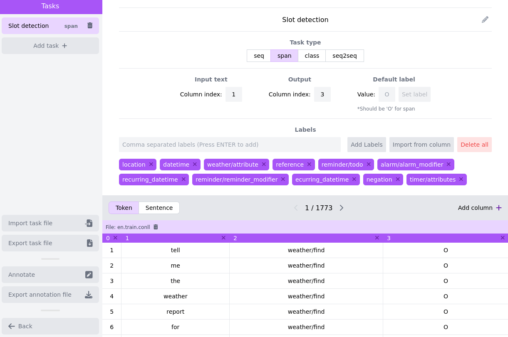
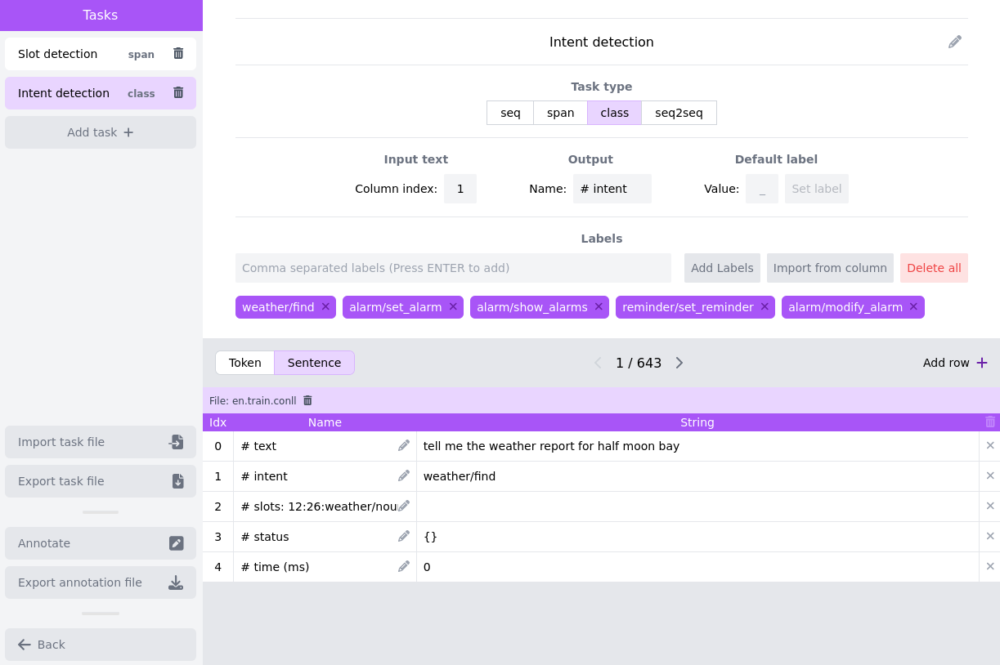
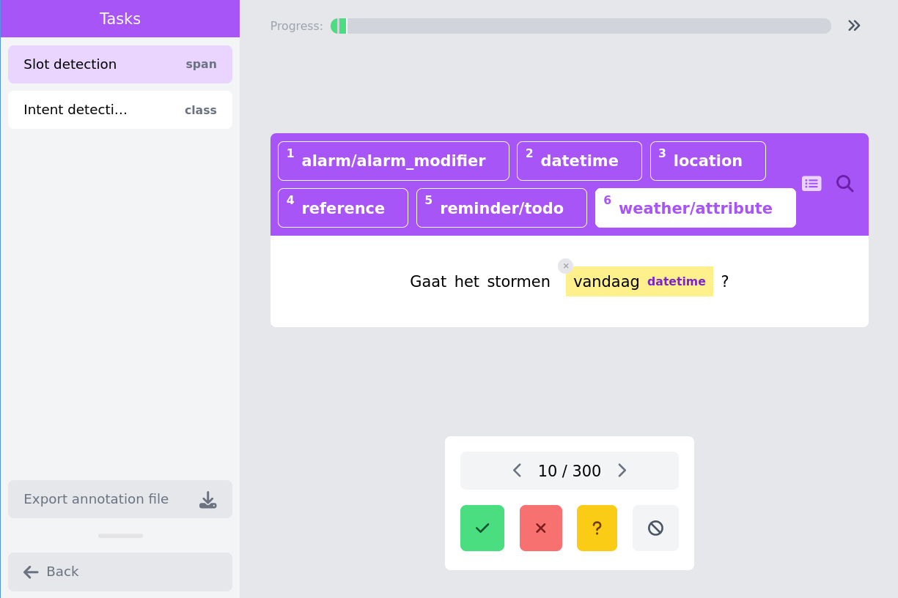

### Annotate slot and intent detection for a new language with Eevee

[Back to main README](../README.md)

[This tutorial is also available as a video](https://youtu.be/COzBEfWdVnA)

On this page we are going to describe how we can create a new evaluation set
for an already existing benchmark. More conretely, we will assume that we have
an English dataset annotated for slot and intent detection. We want to create a
new evaluation dataset for these tasks for Dutch. We will use the English data
to create the Eevee configuration, so that we do not have to enter the labels
manually. The English dataset looks as follows:

```
# text = Is it going to rain today?
# intent = weather/find
# slots: 15:19:weather/attribute,20:25:datetime
1	Is	weather/find	O
2	it	weather/find	O
3	going	weather/find	O
4	to	weather/find	O
5	rain	weather/find	B-weather/attribute
6	today	weather/find	B-datetime
7	?	weather/find	O

```

And can be found in `docs/en.train.conll`. We also have raw data (i.e. not
annotated) for Dutch available in a `.txt` format. These are available in
`docs/nl.eval.txt`. 

## Creating the data configuration
After starting up the annotation tool, we import the English training file with 
gold annotations. This allows us to easily create an Eevee task configuration by
importing the labels. To do this, we click on the `import "Conll-like" file` button:



Now we add the slot detection task through clicking on the `add task +` button.
We have to:
* name the task
* pick the task-type (`span`)
* select the input column where the tool can read the input words, this can
  easily be identified in the data field on the bottom of the page: 1
* select the output column where the tool can write the annotation: 3
* we can now click import from column




For the intent detection task, the procedure is highly similar. Note that the
input column is the same, and the output column is now identified with a string:



## Importing the data
Now we can export the task configuration file, and either: 1) restart Eevee, and
load the task configuration and the Dutch data as txt file, or: 2) remove the current
data and load the Dutch data. In this tutorial we choose the second option. To remove
the current data, we press the trashbin button on top of the data field, and
then we load the new data with the `import txt file' button. It should be noted
that we now have to create the right data fields; for intent detection we have
to add a row, and for slot detection we have to add two columns.


## Annotate
Now we can start annotating, by clicking the `Annotate` button, and we will be on 
the annotation page. We can select the task for which we want to annotate on the left
(or use arrow-up/arrow-down to navigate tasks). For the intent classification task, 
the labels can be selected with a mouse click or with the number keys, and navigation can
be done with the arrows below the utterance, or with the arrow keys on the keyboard (or even
by clicking the progress bar on the top). For the slot detection task, usage is similar, except
that you need to select the span with the mouse to make the annotation.




